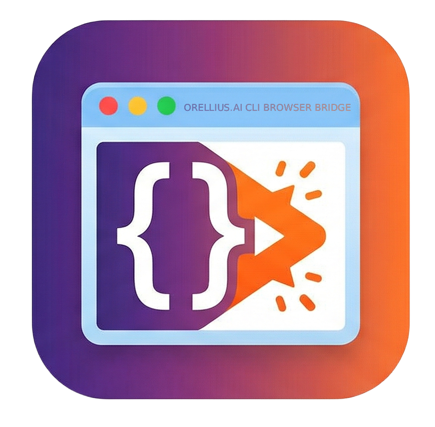

<h1 align="center">
  <br>
  CLI Browser Bridge
</h1>

<p align="center">
  <b>Rust-powered, unrestricted browser automation for Claude Code.</b><br>
  No domain blocklist. Your real, signed-in Chromium browser. 21 MCP tools.<br>
  By <a href="https://orellius.ai">orellius.ai</a>
</p>

<p align="center">
  
  
  
  
  
</p>

---

https://github.com/user-attachments/assets/51043900-c95b-43b9-999c-f856ad752e20

---

CLI Browser Bridge gives [Claude Code](https://claude.ai/code) an MCP-powered bridge into your real, signed-in Chromium browser — with **no domain blocklist**. Claude can navigate, click, type, screenshot, query Shadow DOM, and run JavaScript on any URL. Reddit, X, Discord, paywalled docs, SSO dashboards — all fair game.

**v2.0** is a ground-up Rust rebuild. Single compiled binary, no Node.js, no shell wrappers. Direct native messaging — Chrome launches the binary, it just works.

Works with **Chrome**, **Brave**, **Edge**, and **Arc** on **macOS** and **Linux**.

> **Disclaimer — not affiliated with Claude Code.** This is a fan-made, unofficial community project. It is not endorsed by or connected to Claude Code in any way.

---

## ⚖️ Legal Notice & User Responsibility

> [!CAUTION]
> **By installing or using CLI Browser Bridge you acknowledge and accept full responsibility for every action performed through it.** Read this section in its entirety before proceeding.

### This is a legal tool

CLI Browser Bridge is **lawful software**. It uses only documented, public Chromium APIs (`chrome.debugger`, Native Messaging, Manifest V3) to automate a browser you own, running on your own machine, communicating exclusively over `localhost`. No access controls are bypassed, no authentication mechanisms are circumvented, and no third-party systems are exploited.

### You are the operator

This tool does not act autonomously. Every automation session is initiated by you and executes under your active supervision. **You — not the software, not the developers, and not Anthropic — bear sole responsibility for:**

- Which websites you direct the tool to visit.
- Which actions (posting, commenting, messaging, deleting, purchasing) you instruct it to perform.
- Which browser profile, cookies, and logged-in sessions you expose to it.
- Compliance with all applicable local, state, national, and international laws.

### Respect third-party Terms of Service

> [!WARNING]
> **Most websites prohibit automated access in their Terms of Service.** Violating a site's ToS is a contractual matter between you and that platform.

| Platform | Relevant Policy |
|---|---|
| Reddit | [User Agreement](https://www.redditinc.com/policies/user-agreement) — prohibits automated access without consent. |
| X / Twitter | [Terms of Service](https://x.com/en/tos) — prohibits scraping and automated posting. |
| Facebook / Instagram | [Meta Terms](https://www.facebook.com/terms.php) — prohibits automated data collection. |
| LinkedIn | [User Agreement](https://www.linkedin.com/legal/user-agreement) — prohibits scraping and automated access. |
| Discord | [Terms of Service](https://discord.com/terms) — prohibits self-bots. |
| GitHub | [Terms of Service](https://docs.github.com/en/site-policy/github-terms/github-terms-of-service) — permits API automation, restricts scraping. |

> [!IMPORTANT]
> **Recommended usage:**
> - Always supervise. Don't leave automation unattended.
> - Use a dedicated browser profile.
> - Use `update_plan` to review Claude's intent before it acts.
> - Only automate websites you have authorization to automate.
> - **Do not use for:** spamming, credential stuffing, unauthorized harvesting, impersonation, harassment.

### Limitation of liability

This software is provided **"as is"** under GPL-3.0, without warranty of any kind. See [LICENSE](LICENSE) and [TERMS_OF_USE.md](TERMS_OF_USE.md).

> **You must type "I AGREE" during installation before the software will run.**

---

## TL;DR — Quick Start

```bash
git clone https://github.com/Orellius/cli-browser-bridge.git
cd cli-browser-bridge

# 1. Load extension: chrome://extensions → Developer mode → Load unpacked → extension/
# 2. Copy the extension ID from the card
./install.sh <extension-id>

# 3. Restart browser, then test in Claude Code:
#    "Navigate to news.ycombinator.com and take a screenshot"
```

The installer handles everything: terms acceptance, Rust build, binary install, native messaging manifests, and Claude Code MCP registration.

---

## Why it exists

Most browser-automation MCP tools fall into two camps:

1. **Headless Playwright/Puppeteer** — fresh Chromium every session. No cookies, no logged-in state. Useless for sites that require an account.
2. **Sandboxed extensions with domain blocklists** — they block exactly the sites you'd most want Claude to help with: social media, internal dashboards, review queues.

CLI Browser Bridge is the third option: a real extension in your real browser, with **no domain restrictions**. Claude uses the web the way you do.

---

## What you can do with it

```
"Open reddit.com, go to /r/selfhosted, and post a comment about hardware transcoding."
"Log into my GitHub, open issues for acme/website, triage anything older than 30 days."
"Take a screenshot of each of my latest 5 Linear tickets."
"Open HN front page and summarize everything above 200 points."
"Open X, compose and submit a post with this text."
```

Claude opens a dedicated `MCP` tab group (blue) in your browser and works there.

---

## Architecture

```
Claude Code ──[stdio/MCP]──▶ cli-browser-bridge serve ──[UDS]──▶ cli-browser-bridge (auto) ──[native msg]──▶ Extension
```

**Single Rust binary, two modes:**
- `serve` — MCP server. Claude Code spawns this via stdio. Listens on Unix domain socket.
- **Auto-host** — Chrome launches the binary directly. Detects `chrome-extension://` in argv → enters host mode, connects to serve via UDS.

**Why Rust?** The v1 Node.js version relied on a shell wrapper that macOS silently refused to execute. A compiled binary has zero runtime dependencies.

| Component | Role |
|---|---|
| `cli-browser-bridge serve` | MCP server over stdio + UDS listener for native host |
| `cli-browser-bridge` (auto) | Native messaging host, bridges Chrome ↔ serve via UDS |
| `extension/` | Manifest V3 extension. CDP via `chrome.debugger`, accessibility tree, element refs |

---

## Tools (21)

| Tool | Description |
|---|---|
| `tabs_context_mcp` | List MCP tab group. **Call first.** |
| `tabs_create_mcp` | New tab in MCP group |
| `navigate` | Go to URL or forward/back |
| `computer` | Click, type, scroll, drag, hover, screenshot, zoom, key press. **Human-like typing.** |
| `find` | Find elements by natural language. **Pierces Shadow DOM.** |
| `read_page` | Accessibility tree with stable refs. **Shadow DOM aware.** |
| `form_input` | Set form values by ref |
| `get_page_text` | Extract clean article text |
| `javascript_tool` | Execute JS in page context |
| `read_console_messages` | Filtered console output |
| `read_network_requests` | HTTP request log |
| `gif_creator` | Record + export as animated GIF |
| `upload_image` | Upload screenshot to file input / drag target |
| `resize_window` | Set window dimensions |
| `shortcuts_list` / `shortcuts_execute` | Extension shortcuts |
| `switch_browser` | Switch active browser |
| `update_plan` | Present plan for user approval |
| **`wait_for`** | Wait for element, text, network idle, or JS predicate |
| **`storage`** | Read/write localStorage, sessionStorage, cookies |
| **`dom_query`** | CSS selector query + Shadow DOM piercing + computed styles |

### New in v2

- **Human-like typing** — `computer` with `humanlike: true`: variable 40-180ms delays, natural word-boundary pauses
- **Shadow DOM piercing** — `find`, `read_page`, `dom_query`, `wait_for` traverse Shadow DOM roots
- **`wait_for`** — poll for conditions: element visible/hidden, text match, network idle, JS predicate
- **`storage`** — read/write localStorage, sessionStorage, cookies
- **`dom_query`** — CSS selector queries with optional computed styles
- **Extension popup** — real-time connectivity card

---

## Design choices

- **No domain blocklist.** Every tool works on any URL Chromium will load.
- **Tab grouping.** Claude's tabs live in a dedicated `MCP` tab group (blue).
- **Single active connection.** One browser profile at a time.
- **Reconnect-aware.** In-flight requests survive service worker restarts.
- **Stale-server cleanup.** PID file, SIGTERM orphans on restart.
- **Local-only, no telemetry.** Everything over `localhost`.

---

## Installation

### Prerequisites

- **Rust** ([rustup.rs](https://rustup.rs))
- **Claude Code** ([docs](https://docs.claude.com/claude-code))
- **Chromium browser** — Chrome, Brave, Edge, or Arc (116+)

### Full install

```bash
git clone https://github.com/Orellius/cli-browser-bridge.git
cd cli-browser-bridge

# Load extension first:
# chrome://extensions → Developer mode → Load unpacked → extension/
# Copy the extension ID

./install.sh <extension-id>

# For multiple browsers:
./install.sh <chrome-id> <brave-id> <edge-id>
```

The installer:
1. Displays terms of use, requires "I AGREE"
2. Builds the Rust binary
3. Installs to `~/.local/bin/cli-browser-bridge`
4. Registers native messaging manifests for all detected browsers
5. Registers the MCP server with Claude Code (`--scope user`)
6. Verifies everything works

### Test it

Start a new Claude Code session:

> *"Navigate to news.ycombinator.com and take a screenshot."*

---

## Security notes

> See also: [Legal Notice](#%EF%B8%8F-legal-notice--user-responsibility) above.

- The extension requests `<all_urls>` and the `debugger` permission.
- There is no domain blocklist.
- Your cookies and logged-in sessions are the access model.
- **Consider using a dedicated browser profile.**
- Communication is `localhost`-only. No outbound telemetry.

---

## Project structure

```
cli-browser-bridge/
├── src/                    # Rust source (all files <300 lines)
│   ├── main.rs             # CLI dispatcher
│   ├── serve.rs            # MCP server + UDS listener
│   ├── host.rs             # Native messaging + UDS client
│   ├── config.rs           # Constants
│   ├── error.rs            # Typed errors
│   ├── lifecycle.rs        # PID, socket, signals
│   ├── native_messaging.rs # Chrome native messaging codec
│   ├── mcp/
│   │   ├── transport.rs    # JSON-RPC 2.0 stdio
│   │   ├── tools.rs        # Core tool schemas
│   │   └── tools_advanced.rs
│   └── bridge/
│       └── protocol.rs     # UDS wire protocol
├── extension/              # Chrome MV3 extension
│   ├── manifest.json
│   ├── background.js       # Entry, native messaging, CDP events
│   ├── cdp.js              # DevTools Protocol helpers
│   ├── tabs.js             # Tab group management
│   ├── tools.js            # Core tool handlers
│   ├── tools-advanced.js   # wait_for, storage, dom_query
│   ├── content.js          # A11y tree, element refs, Shadow DOM
│   ├── popup.html/js/css   # Status card
│   └── icons/
├── install.sh              # Full installer
├── Cargo.toml
├── demo.mp4
└── README.md
```

---

## Platform support

| Platform | Status |
|---|---|
| macOS | ✅ Supported |
| Linux | ✅ Supported |
| Windows | Not yet — PRs welcome |

---

## License

[GPL-3.0](LICENSE) — use, modify, redistribute under the same license with source available.

---

<p align="center">
  Built with Rust and Claude Code by <a href="https://orellius.ai">orellius.ai</a>
</p>
